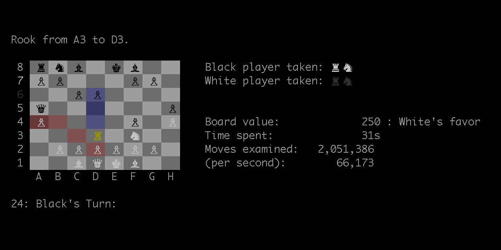

# JavaChess
===
24-bit ANSI colored, console-based chess using Java.  Optional multi-threaded AI using Minimax with alpha-beta pruning.  Fully configurable properties including: ply depth, thread pool size, optional AI time limit, all colors, and more.




### Running the program:

$ java -jar chess.jar


#### To play against the computer change the _humanPlayer_ value to true in the editable chess.properties file and re-run the jar file.  Or change any of the other options and re-run the jar file.  Play around!  Many interesting combinations are vailable there:


```
#
# Usage:
#
# General Game Settings:
# numDrawReps         number of repeated moves to call game a draw
#
# AI Settings:
# humanPlayer:        set to true to play as player 1 (white)
# maxThreads:         maximum number of threads for AI to run simultaneously
# aiPlyDepth:         maximum number of moves for AI to look ahead
# maxAISeconds:       maximum number of seconds to allow AI to think (0 for no time limit)
#
# UI Settings:
# showVictims:        color the board to show current players possible moves if true
# showTargets:        color the board to show opponents possible moves if true
# showCapturesOnly:   limit board coloring to only show possible captures if true
#
# player1             label to use for player 1
# player2             label to use for player 2
#
# ANSI Colors (24-bit):
# blkBack             background color for dark squares
# whtBack             background color for light squares
#
# blkForeB            foreground color for black piece on dark square
# blkForeW            foreground color for black piece on light square
#
# whtForeB            foreground color for white piece on dark square
# whtForeW            foreground color for white piece on light square
#
# blkMoved            foreground color for last moved black piece
# whtMoved            foreground color for last moved white piece
#
# blkCheck            foreground color for black king in check
# whtCheck            foreground color for white king in check
#
# targetsShade        color influence for target positions
# victimsShade        color influence for victim positions
#
#
#Wed Jul 03 01:13:30 CDT 2019
numDrawReps=3

humanPlayer=false
maxThreads=100
aiPlyDepth=6
maxAISeconds=75

showVictims=true
showTargets=true
showCapturesOnly=true

player1=Player 1
player2=Player 2

blkBack=142, 142, 142
whtBack=204, 204, 204

blkForeB=64, 64, 64
blkForeW=0, 0, 0

whtForeB=255, 255, 255
whtForeW=255, 255, 255

blkMoved=192, 0, 0
whtMoved=0, 0, 255

blkCheck=192, 128, 0
whtCheck=192, 128, 0

targetsShade=0, 0, 128
victimsShade=160, 0, 0

```
